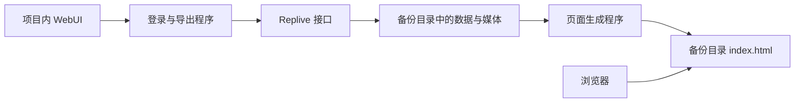

<p align="center"></p>

# RepArchive

**通过 WebUI 备份 Replive 资源，并生成可直接打开的日文本地浏览页面。**

RepArchive 将登录、导出、更新资源、生成页面和文件校验集中在一个控制台中。导出成果保存在自选目录，可离开项目单独浏览。运行时只需 Python，无需 Go、Node.js、ffmpeg 或抓包工具。

本项目基于 [nsy_chat_live](https://github.com/huangwg2529/nsy_chat_live) 的协议与登录流程进行 Python 重写和扩展，并参考了 [Replive+](https://github.com/monamona0917/replive-plus)。具体继承范围、固定版本和许可证状态见 [项目继承与致谢](#项目继承与致谢)、[NOTICE.md](NOTICE.md)。

## 功能

| 功能 | 说明 |
| --- | --- |
| 登录 | 已有 Replive 账号的手机号短信登录、Google、X / Twitter；也可导入 refresh_token 或原项目配置 |
| 聊天备份 | Fandom Chat 文字、图片、短视频及可取得的封面；双向分页读取历史记录 |
| 补充资源 | 订阅清单、人物资料、提问卡片、可访问的独立回答视频、封面、字幕、本人回答及收藏列表 |
| 更新资源 | 使用原备份目录读取新增内容，复用已经下载的资源 |
| 可读文件 | 按人物、月份、日期和问题组织资源；聊天记录另存 Markdown、CSV、JSONL |
| 本地页面 | CHATS、リプライ、推し、保存；聊天搜索、日期筛选、图片放大、字幕、浏览器收藏 |
| 媒体播放 | 播放新媒体时暂停先前的媒体；聊天历史自动完整加载，图片延迟加载 |
| 任务管理 | 当前任务跨页面置顶，显示开始、结束时间和耗时，停止任务、清除最近任务记录 |
| 校验 | 根据大小、SHA-256 和生成文件清单检查原始媒体与浏览文件 |
| 部署 | macOS、Windows、Linux 启动脚本；可选 Docker Compose |

控制台使用中文，生成页面保留日文并适配手机和电脑。人物背景统一比例显示；项目 Logo 为 RepArchive 标识。

## 快速开始

### 1. 获取项目

克隆本仓库，然后进入项目目录：

```sh
git clone https://github.com/Gu-Haojia/RepArchive.git
cd RepArchive
```

保留整个文件夹即可部署；源码位于 `src/`，测试位于 `test/`。

### 2. 安装 Python

需要 **Python 3.10 或更新版本**，以及首次准备环境时用于下载依赖的网络连接。

- macOS / Linux：确认 `python3 --version` 至少为 3.10。
- Windows：安装 Python 时启用 PATH，或使用 Python Launcher，确认 `py -3 --version`。

项目固定了依赖版本，见 [requirements.txt](requirements.txt)。标准库 `zoneinfo` 配合 `tzdata` 支持缺少系统时区数据库的环境。

### 3. 启动控制台

| 平台 | 启动入口 | 命令行方式 |
| --- | --- | --- |
| macOS | 双击 `start.command` | `./start.command` |
| Windows | 双击 `start.bat` | `start.bat` |
| Linux | 运行 `start.sh` | `sh start.sh` |

启动脚本会自动完成以下操作：

1. 首次创建项目专用 `.venv`，安装依赖。
2. 根据 `src/protocols/*.proto` 生成 Python 协议绑定。
3. 启动控制台并打开浏览器：<http://127.0.0.1:8769/>。

后续启动复用 `.venv`，依赖清单变化时才重新安装依赖。重复启动会识别已有控制台。首次启动耗时主要取决于依赖下载速度。

需要自定义端口或不自动打开浏览器时：

```sh
python3 src/bootstrap.py --port 8770 --no-browser
```

Windows 使用 `py -3 src/bootstrap.py --port 8770 --no-browser`。已有 `.venv` 时也可使用其中的 Python 执行同一命令。

## 使用流程

1. 在 **账号与设置** 登录已有 Replive 账号。登录完成后可验证会话、修改默认保存位置。
2. 在 **导出任务** 选择保存位置，点击 **开始导出**。请选择空目录或本工具已有的备份目录。
3. 当前任务显示在各页面顶部。任务结束后记录结果，并生成本地页面及人物资源目录。
4. 在 **备份库** 打开页面，或执行 **更新资源**、**生成页面**、**校验资源**。
5. 以后浏览时，直接打开备份目录的 `index.html`。仅在更新、重新生成或校验时需要启动控制台。

**更新资源**会继续读取接口当前可访问的内容并复用已有媒体；**生成页面**只使用本地数据库和资源，不需要登录；**校验资源**检查文件完整性，不会自动补下载。

停止任务后会保留已经保存的数据，下一次更新可以继续。停止发生在网络请求或媒体分块边界，当前请求需先结束或超时。清除最近任务只删除任务记录，不删除资源，也不会中断当前任务。备份库的“移除”只取消登记，保留磁盘上的文件；以后可以重新添加。

### 手机号登录

填写原账号已绑定的手机号和国际区号，再发送短信验证码：日本 `81`，中国 `86`。号码可以按当地格式填写，程序会规范化。发送后填写短信中的数字验证码即可。

此流程用于登录已有账号；新账号注册、恢复已删除账号及账号绑定请在原 App 中处理。短信受官方接口和频率限制约束，遇到频率提示请稍后重试。

### Google / X 登录

1. 选择 **Google 登录** 或 **X / Twitter 登录**。程序自动准备本机登录回调。
2. 点击 **用系统浏览器打开**，在浏览器完成授权。
3. 浏览器返回登录结果后，控制台保存 Replive 会话。macOS 可能提示打开 `RepArchive Login`，选择打开即可。

登录完成、取消、十分钟超时、退出登录或关闭服务时，程序自动停止接收回调。回调协议接收程序会保留供后续登录复用：macOS 使用项目内的回调 App，Windows 注册当前用户协议，Linux 使用 `xdg-mime`。这与后台常驻代理无关。

Docker、缺少 `xdg-mime` 或不能自动关联协议的环境会显示手动回调输入。复制本次授权产生的完整回调地址，再点击 **完成登录**；也可导入已有会话。控制台需在授权期间保持运行。

目前没有实现 Apple、LINE 登录。若原账号只有这些入口，可导入已有 refresh_token；工具不会自动为账号绑定其他登录方式。

### 导入已有会话

在 **账号与设置 → 导入 refresh_token / 原项目配置** 中粘贴单个 refresh_token，或包含该字段的配置内容，再点击 **导入并验证**。支持原项目常见的 `refresh_token` / `refreshToken` 字段。

Replive 会话保存在 `.private/refresh_token.txt`。退出登录会删除本机保存的会话；它不等同于官方服务端撤销全部设备的登录状态。

## 导出目录

```text
自定义备份目录/
├── index.html                     日文本地浏览页面
├── 页面资源/                       样式、脚本和按房间拆分的数据
├── 人物/姓名_完整ID/
│   ├── 资料.json、头像.jpg、背景.jpg
│   ├── 聊天记录.md / .csv / .jsonl
│   ├── 图片/YYYY-MM/日期_消息ID.jpg
│   ├── 视频/YYYY-MM/日期_消息ID.mp4
│   ├── 视频封面/YYYY-MM/...
│   └── 回答视频/YYYY-MM/日期_问题摘要_视频ID/
│       └── 回答.mp4、问题.txt、封面.jpg、动态封面.gif、字幕.vtt、详情.json
├── 其他资料资源/
├── 导出报告.json、缺失资源.json、校验报告.json
├── 备份说明.md
├── archive-site.json              生成文件清单与校验信息
└── _data/                         更新、生成和校验使用的原始数据
    ├── archive.sqlite3、media/
    ├── metadata/、raw/
    └── report.json、media_manifest.json、旧版页面
```

扩展名以实际资源格式为准。人物目录内的媒体优先通过硬链接复用 `_data/media/`，不支持硬链接时退回复制。复制到其他文件系统时可能占用两份媒体空间；修改硬链接文件也会修改原始资源。

- **迁移完整备份**：复制整个备份目录，再通过备份库的 **添加已有备份** 登记新位置。
- **移动整个项目**：启动时会更新项目内部的默认保存位置和备份库路径，保留原有备份库标识。项目外部的备份不会跟着迁移，需要添加其新位置。文件选择窗口的初始路径失效时，会打开最近的有效父目录。
- **仅保留浏览成果**：复制 `index.html`、`页面资源/`、`人物/`、`导出报告.json`、`缺失资源.json`。以后要更新或重新生成时仍需完整 `_data/`。
- **旧版目录**：本工具识别的旧结构会迁入 `_data/`，数据库中的相对媒体路径不变。其他项目的数据库格式不保证兼容。
- **本地收藏**：生成页面的“保存”记录在当前浏览器的 localStorage 中。更换浏览器、清理浏览器数据或改变页面来源后，收藏状态可能不同。

生成页面使用本地脚本加载数据，支持直接打开 HTML，不要求启动 HTTP 服务。视频播放格式取决于浏览器的媒体解码能力；回答字幕有数据时可通过“字幕”切换。

## 控制台与浏览页面



项目控制台负责操作任务和账号；浏览页面是生成成果。移动浏览成果或关闭控制台不影响已经保存的内容。

## 完整性与边界

导出范围取决于账号权限、服务端当前可访问内容和已实现接口。请以 `导出报告.json` 和 `缺失资源.json` 为准：

| 报告字段 | 含义 |
| --- | --- |
| `chat_snapshot_complete` | 本次聊天双向分页结束，聊天读取及对应媒体检查满足完整性条件 |
| `accessible_content_complete` | 已实现的可访问列表、订阅与房间匹配、资源下载等检查满足条件 |
| `all_subscribed_content_complete` | 所有类型订阅内容的整体完整性；目前为 `false` |

历史直播回放、未公开内容、已撤回或账号无权读取的资源无法保证取得。当前项目没有移植上游的直播监控与 ffmpeg 录制，也没有实现消息发送或 Prime Chat 导出。`accessible_content_complete=true` 不代表所有类型的订阅内容都已保存。

服务停用后，已经下载的页面和媒体可以继续浏览；登录、获取新增内容、补下载依赖在线接口，不能保证继续可用。

## Docker Compose

需要可运行的 Docker 和 Compose：

```sh
docker compose up --build -d
# 停止
docker compose down
```

打开 <http://127.0.0.1:8769/>。默认映射关系：

| 容器路径 | 宿主机路径 |
| --- | --- |
| `/app/exports` | `./exports` |
| `/app/.private` | `./.private/docker` |

默认保存位置为 `/app/exports/account`。需要使用其他宿主目录时，请添加卷挂载，并在 WebUI 中填写容器内路径。容器中的会话与宿主机直接运行的会话分开。

Compose 默认只向本机发布端口。项目以本地使用为前提，没有用于公网的账号系统；不要将控制台直接暴露到互联网。

## 项目目录与开发

```text
RepArchive/
├── README.md、NOTICE.md、.gitignore
├── start.command / start.bat / start.sh
├── requirements.txt
├── Dockerfile、compose.yaml、.dockerignore
├── docs/
│   ├── USAGE.md
│   └── ATTRIBUTION.md
├── src/
│   ├── bootstrap.py              环境准备与启动
│   ├── webui.py、web/            WebUI 与任务、账号管理
│   ├── archive_site.py、viewer/  可读资源与浏览页面生成
│   ├── export_replive.py         聊天与媒体采集
│   ├── phone_login.py            手机号登录
│   ├── sns_login.py              Google / X 登录
│   ├── callback_bridge.py        本机授权回调
│   ├── extra_content.py          提问与独立回答等补充内容
│   └── protocols/                最小化 protobuf 定义
└── test/                         本地测试
```

运行后产生 `.venv/`、`src/generated/`、`.private/` 和默认 `exports/`，均不应提交到 Git。运行环境不建议跨电脑复制；新电脑通过启动脚本重新创建。

```sh
# 只准备运行环境及协议绑定
python3 src/bootstrap.py --setup-only

# 根据已有数据生成页面，不请求在线内容
.venv/bin/python src/export_replive.py --generate --output /完整备份目录

# 校验已有文件
.venv/bin/python src/export_replive.py --verify --output /完整备份目录

# 使用本机保存的会话更新资源
.venv/bin/python src/export_replive.py --token-file .private/refresh_token.txt --output /完整备份目录

# 运行本地测试
.venv/bin/python -m unittest discover -s test -t . -q
```

Windows 将 `.venv/bin/python` 替换为 `.venv\Scripts\python.exe`，其他参数保持一致。

### 验证状态

发布前在 macOS 上完成本地测试、全新目录的环境准备及启动检查，并对实际导出资源进行了完整性校验。测试中的第三方授权交换使用模拟响应；实际 Google / X 账号的完整授权流程尚未实测。

Windows、Linux 的系统回调与启动入口已实现，尚未实机验证。Docker Compose 配置已通过语法检查，容器构建与运行尚未实测。测试不会自行向真实手机号发送短信。

### 问题反馈

提交 Issue 时请提供操作系统、Python 版本、触发步骤、脱敏后的错误信息和报告摘要。请勿上传 `.private/`、验证码、refresh_token、完整授权回调地址、含签名参数的资源 URL 或私人订阅内容。

## 常见问题

**第一次启动提示找不到 Python或版本过低。** 安装 Python 3.10+，确认终端能找到它。系统自带 Python 不一定满足版本要求。已有 `.venv` 时启动脚本会优先使用该环境。

**端口 8769 被其他程序占用。** 使用 `--port 8770` 等其他本机端口；如果同端口已经是本工具，启动脚本会复用已有控制台。

**换电脑后不能使用旧 `.venv`。** 将源码和完整备份分别复制到新电脑，重新创建运行环境，再登记备份目录；不要依赖旧虚拟环境的绝对路径。

**视频较多、备份很大。** 独立回答通常是单独的 MP4 文件。请预留足够空间，并在任务状态中查看媒体数量；大小和缺失情况见导出报告。

**导出中断或资源缺失。** 先确认账号、网络和空间，再对原目录执行更新资源。校验只能发现文件问题，补下载还需要接口可用。

**本机回调没有自动完成登录。** 保持控制台运行，使用本次授权对应的系统浏览器；必要时展开手动完成回调。授权超过十分钟后需要重新开始。

**退出登录和关闭服务有什么区别？** 退出登录删除本机保存的 Replive 会话；关闭服务结束控制台和当前回调接收，保存的会话与导出文件保留。浏览成果可继续直接打开。

## 项目继承与致谢

RepArchive 是新的 Python 实现，沿用了 Replive 社区工具已有的协议知识和登录参考。主要来源如下：

| 来源 | 固定参考版本 | 本项目中的用途 |
| --- | --- | --- |
| [huangwg2529/nsy_chat_live](https://github.com/huangwg2529/nsy_chat_live) | [`69c6d519`](https://github.com/huangwg2529/nsy_chat_live/tree/69c6d519cb0b394f839296d2af51f5e954078b81) | 基础 protobuf 字段与编号、聊天分页和令牌刷新流程、Google / X 登录流程参考 |
| [monamona0917/replive-plus](https://github.com/monamona0917/replive-plus) | [`36702a9f`](https://github.com/monamona0917/replive-plus/tree/36702a9f03386f464fbe23bfd81b0f7a62c10481) | 社区实现与功能结构的参考；它的 README 标明继承自 nsy_chat_live 与 replive-oyu |
| [Chilfish/replive-oyu](https://github.com/Chilfish/replive-oyu) | 间接来源 | Replive+ 标注的前端来源；本仓库没有直接收录该项目前端源码 |
| Replive App 的协议模型 | Android 4.8.1 / iOS 4.7.3 的对应模型 | 手机号登录、补充内容、SNS 认证字段的互操作研究；本仓库不分发 APK 或反编译源码 |

原项目使用说明见 [飞书参考教程](https://my.feishu.cn/wiki/PXe9wkiksifZR9kpVoucsKs1nQe)。本项目增加了短信登录、自动回调、统一 WebUI、独立静态页面、可读目录、更新和校验流程；没有将上游全部功能移植为本工具的功能承诺。

感谢上游作者公开的实现和协议研究。更多文件级来源见 [docs/ATTRIBUTION.md](docs/ATTRIBUTION.md)。

### 许可证状态

截至 2026-10-05，所参考的 `nsy_chat_live` 与 `Replive+` 固定版本未提供明确的 LICENSE，本仓库暂不声明覆盖全部内容的统一开源许可证，也不将上游内容重新标为 MIT、Apache-2.0 等许可。

上游代码、协议定义、第三方依赖和 Replive 内容的权利归相应权利人。公开展示源码与说明来源不等同于取得任意商业使用或再分发授权。相关说明见 [NOTICE.md](NOTICE.md)；许可证的一般说明可参考 [GitHub 官方文档](https://docs.github.com/en/repositories/managing-your-repositorys-settings-and-features/customizing-your-repository/licensing-a-repository)。

## 免责声明

1. **非官方项目。** RepArchive 与 Replive 的运营方及内容创作者没有隶属、合作或授权背书关系。Replive 名称、相关商标及内容权利归其权利人。
2. **使用范围。** 工具面向本人账号当前有权访问内容的个人备份。使用者应遵守适用法律、服务条款及内容授权约定；本项目不授予订阅内容的公开传播、商业利用或转售权利。
3. **权限边界。** 工具不会赋予账号新的访问权限。不得将其用于盗用会话、绕过付费或权限限制、访问他人账号，或批量传播受保护内容。
4. **数据与账号。** 登录和导出会访问第三方在线接口，可能受到账号状态、频率限制、接口变化或服务停止影响。请自行妥善保存凭据与备份，并评估账号和数据使用风险。
5. **按现状提供。** 软件和文档按现状提供，不保证持续可用、特定用途适用性、导出完整性或完全无误。在适用法律允许的范围内，维护者不对因使用或无法使用本工具造成的损失作保证或承担责任；本声明不排除依法不能排除的责任。
6. **权利反馈。** 若你是相关权利人并对仓库中的具体内容有异议，请通过 Issue 提供对应文件、权利依据和联系渠道，维护者将核实并处理。请勿在公开 Issue 中提交个人凭据或私人订阅内容。

本声明不能替代第三方授权，也不能使未经授权的行为获得许可。
